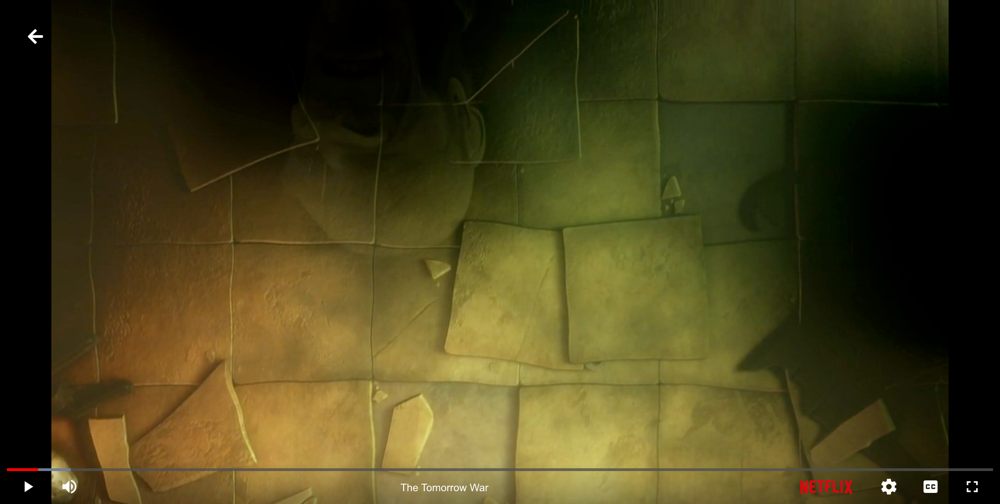
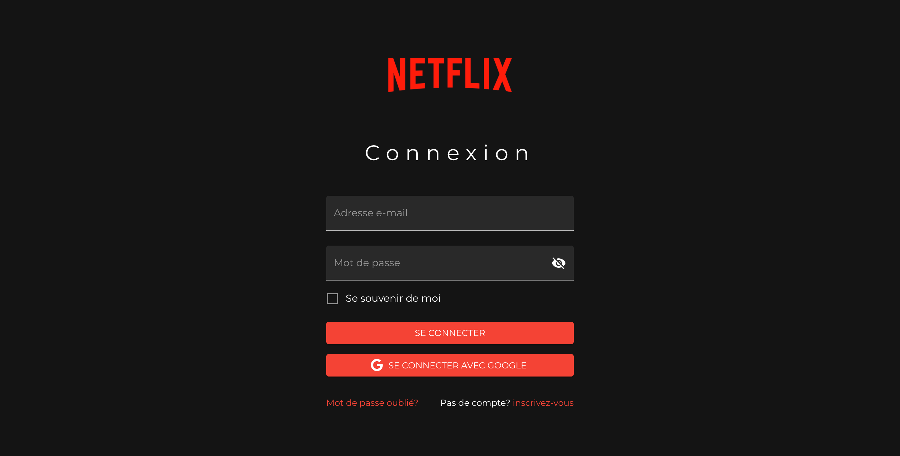

# X-Netflix
X-Netflix is a streaming platform based on Netflix UI: built with ReactJS in frontend and nodeJS in backend.

## Built with

  <b>FrontEnd:</b> React.JS, Redux Library, Material UI, CSS
  <b>Backend: </b> Node.JS, Express.JS, Passportjs
  <b>Database:</b>MongoDB, Mongoose
</ul>

## UI

### Home


### Movie Page


### TV Show Page


### Player



### Sign in



### Sign up


<h2>Installation </h2>

Use the package manager [npm](https://www.npmjs.com/) to install X-Netflix.
Setup the project and install the packages by running: 
```bash
npm run setup
```
 Run project with command
 
```bash
npm run dev
```


